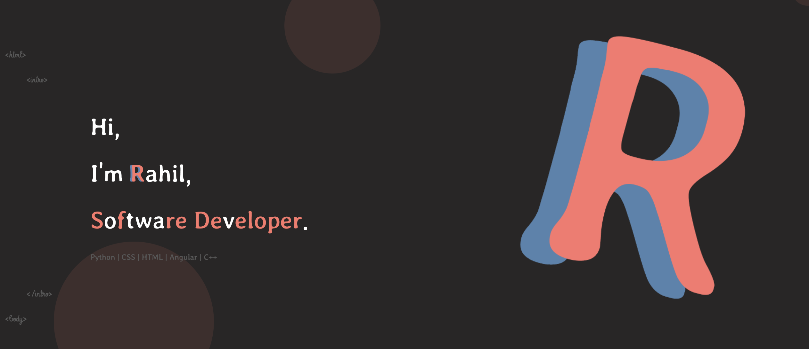

Developer 🎧🎯

Experienced software engineer skilled in both Backend and Frontend roles with over 3 years of experience in Product Development and Software Engineering. Committed to building highly scalable and resilient products that can handle large-scale demands while maintaining robustness and reliability. Passionate about Software Engineering and Product Development, with a naturally curious and creative mindset. Enthusiastic about learning and succeeding in every challenge, with an unstoppable drive to bring ideas to life.

My Skill Set:

- JavaScript (ES5/ES6), Typescript, jQuery, WebPack
- Python, C, C++, JAVA
- HTML5, SCSS, CSS3, LESS
- Angular, Node.js, Express.js, React.js, Vue.js, Angular.js, Handlebars, Django
- MySQL, SQL, MongoDB, Postgres, SQLITE 3
- Agile, SCRUM
- CI/CD, E2E testing, Unit testing, Micro-services
- Software Development Life Cycle (SDLC)
- Git, Github, BitBucket
- Docker, Kubernetes 

Personal Website 🌐 : https://rahilhastu.github.io/rahil/home
